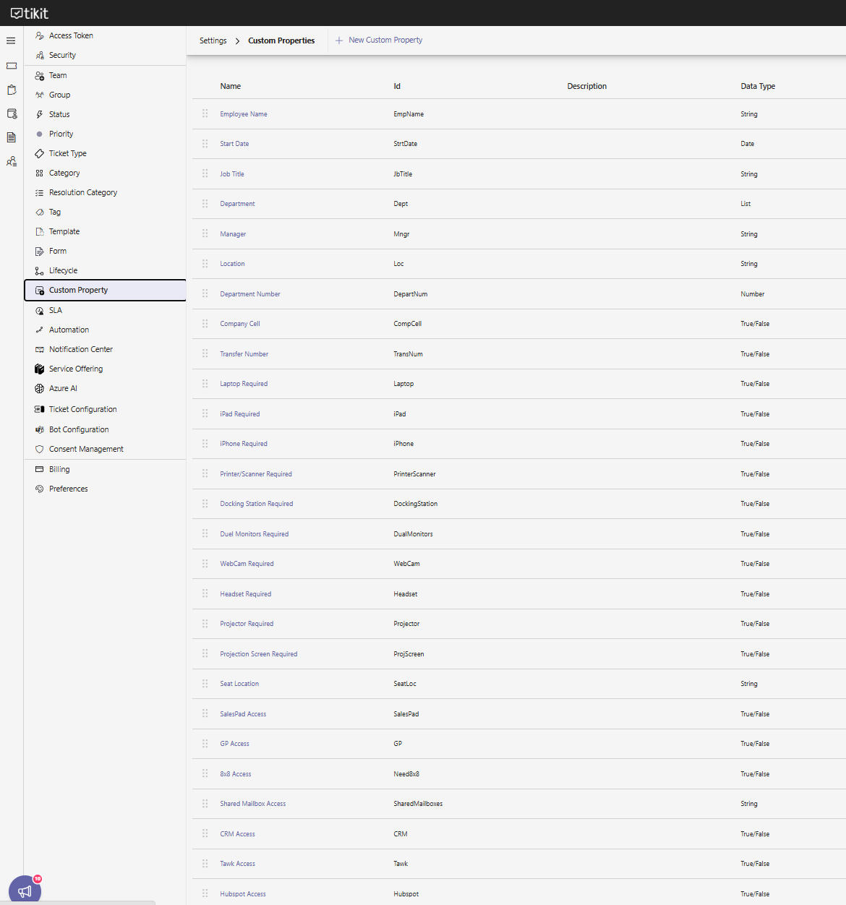
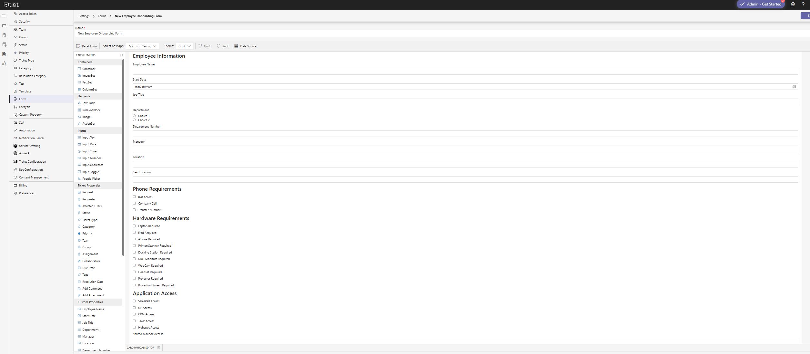
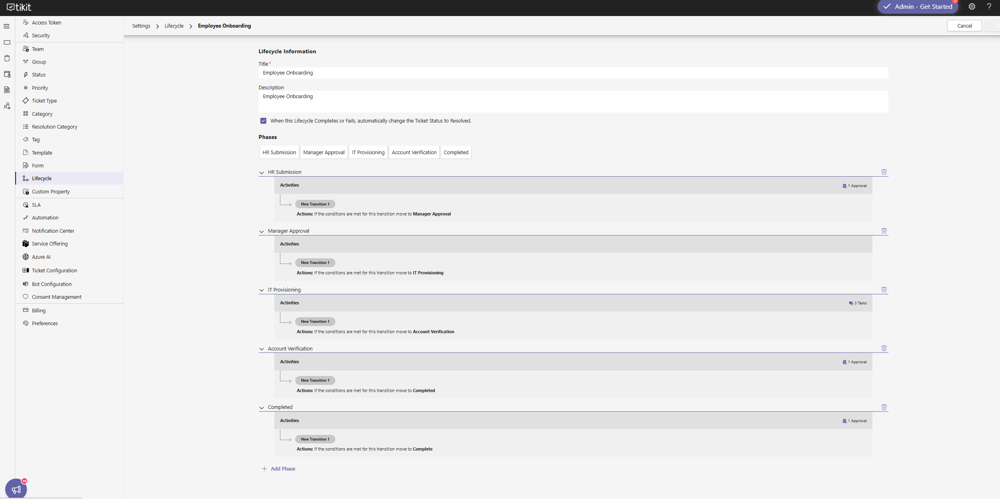
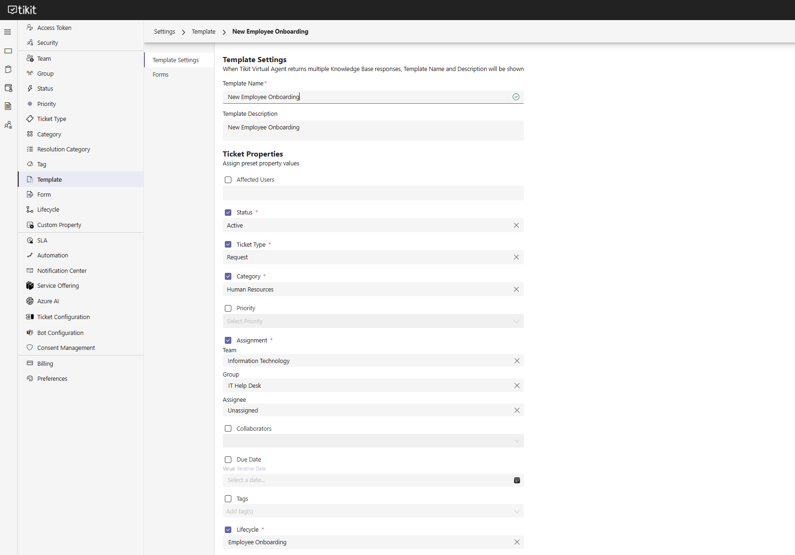
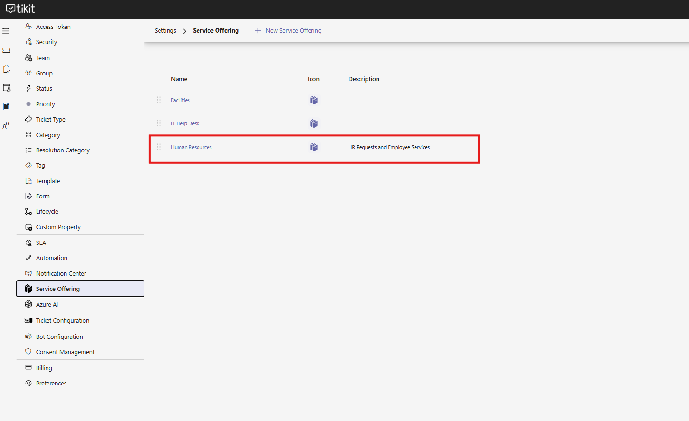
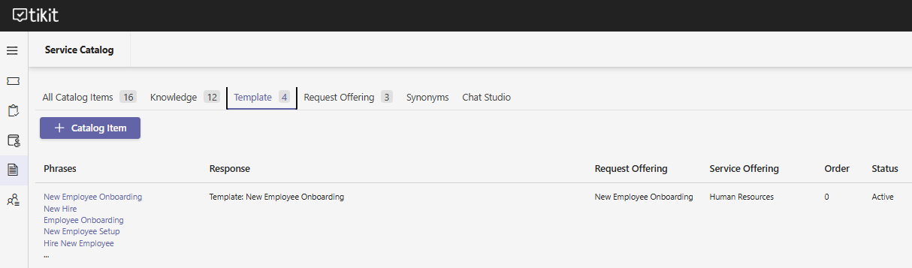
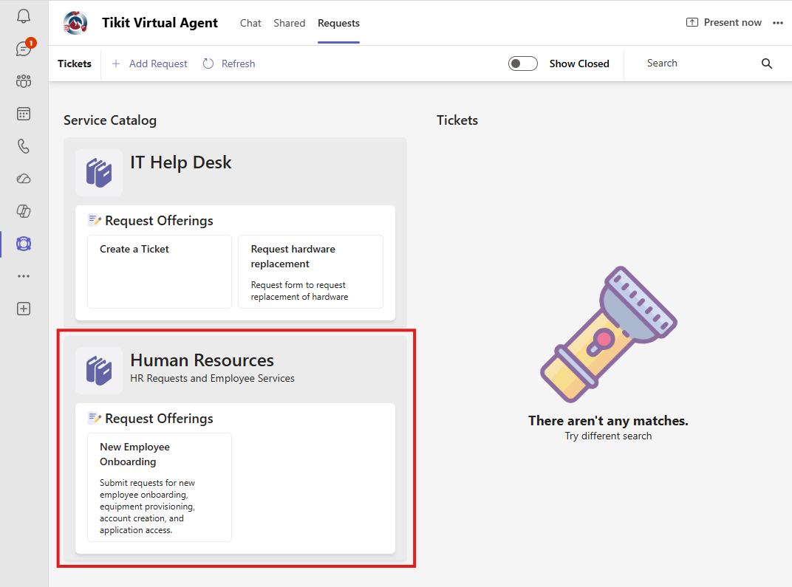

# Employee Onboarding Workflow in Tikit

## Project Overview

This project demonstrates the design and implementation of a centralized Employee Onboarding workflow using Tikit and Microsoft Teams.

The goal was to provide Human Resources with a standardized onboarding process while enabling IT to efficiently track, provision, and complete onboarding tasks through a structured workflow.

The solution centralizes onboarding requests, standardizes information collection, and provides visibility into employee provisioning from request submission through completion.

---

## Business Scenario

Human Resources needed a consistent process for submitting new employee onboarding requests.

Previously, onboarding information was communicated through emails and manual requests, increasing the risk of missing critical hardware, software, or account provisioning requirements.

To improve efficiency and consistency, a custom Employee Onboarding workflow was developed within Tikit and published through Microsoft Teams.

---

## Technologies Used

- Tikit Service Management
- Microsoft Teams
- Microsoft 365
- Service Catalog
- Lifecycle Management
- Custom Properties
- Workflow Automation

---

## Solution Design

### Human Resources Service Offering

A dedicated Human Resources Service Offering was created to house onboarding-related services and requests.

### Employee Onboarding Lifecycle

A custom lifecycle was designed with the following phases:

1. HR Submission
2. Manager Approval
3. IT Provisioning
4. Account Verification
5. Completed

This lifecycle provides visibility into onboarding progress and ensures accountability at each stage.

---

## Custom Properties Created

### Employee Information

- Employee Name
- Start Date
- Job Title
- Department
- Manager
- Location
- Department Number

### Communication Requirements

- Company Cell
- Transfer Number

### Hardware Requirements

- Laptop Required
- iPad Required
- iPhone Required
- Printer/Scanner Required
- Docking Station Required
- Dual Monitors Required
- Webcam Required
- Headset Required
- Projector Required
- Projection Screen Required

### Application Access Requirements

- SalesPad Access
- GP Access
- Bull Access
- CRM Access
- Task Access
- HubSpot Access
- Shared Mailbox Access

### Workspace Information

- Seat Location

---

## Custom Onboarding Form

A custom onboarding form was created using Tikit's Form Builder.

The form collects:

- Employee information
- Department information
- Hardware requests
- Application access requirements
- Workspace requirements

By collecting all onboarding requirements during the initial request, the process reduces back-and-forth communication and ensures IT receives complete information.

---

## Template Configuration

A dedicated onboarding template was created with the following configuration:

| Setting | Value |
|----------|---------|
| Ticket Type | Request |
| Category | Human Resources |
| Team | Information Technology |
| Group | IT Help Desk |
| Lifecycle | Employee Onboarding |

The template automatically routes onboarding requests to the IT Help Desk for processing.

---

## Service Catalog Integration

The onboarding workflow was published to the Tikit Service Catalog under the Human Resources Service Offering.

### Catalog Item

**New Employee Onboarding**

### Alternative Phrases

- New Hire
- Employee Onboarding
- Hire New Employee
- Employee Setup
- New Employee Setup

These phrases allow users to locate the onboarding workflow using natural language within Microsoft Teams.

---

## Microsoft Teams Integration

The onboarding workflow was successfully integrated with Tikit's Teams Virtual Agent.

Users can initiate onboarding requests directly from Microsoft Teams by entering phrases such as:

- New Employee Onboarding
- New Hire
- Employee Setup

The Virtual Agent presents the onboarding form and automatically creates a Tikit ticket upon submission.

---

## Workflow Process

### Phase 1 – HR Submission

Human Resources completes the onboarding request form.

### Phase 2 – Manager Approval

Manager reviews and approves onboarding requirements.

### Phase 3 – IT Provisioning

IT provisions:

- Hardware
- User accounts
- Software access
- Shared mailboxes
- Department resources

### Phase 4 – Account Verification

IT verifies:

- Account functionality
- License assignment
- Access permissions

### Phase 5 – Completed

The onboarding request is marked complete and documented for future reference.

---

## Results

The completed solution provides:

- Centralized onboarding requests
- Standardized employee information collection
- Consistent hardware provisioning
- Consistent software access requests
- Improved onboarding visibility
- Microsoft Teams integration
- Service Catalog automation
- Lifecycle-based workflow tracking

---

## Skills Demonstrated

### IT Service Management (ITSM)

- Service Catalog Design
- Ticket Template Creation
- Workflow Automation
- Lifecycle Management
- Request Routing

### Microsoft 365 Administration

- Microsoft Teams Integration
- User Provisioning Processes
- Shared Mailbox Planning
- Access Management Concepts

### Business Process Improvement

- Process Standardization
- Workflow Design
- Cross-Department Collaboration
- Service Delivery Optimization

### System Administration

- User Onboarding Processes
- Hardware Deployment Planning
- Application Access Management
- Service Request Administration

---

## Future Enhancements

Potential future improvements include:

- Automated manager approval routing
- Power Automate integration
- Automated Microsoft 365 account creation
- Automated license assignment
- Microsoft Entra ID integration
- Equipment inventory integration
- Automated onboarding notifications

---

## Screenshots

### Custom Properties

### Employee Onboarding Form

### Employee Onboarding Lifecycle

### Onboarding Template

### Human Resources Service Offering

### Service Catalog Configuration

### Microsoft Teams Integration

### Ticket Creation Test

---

## Key Takeaways

This project demonstrates the ability to design, implement, and deploy a complete employee onboarding workflow using Tikit and Microsoft Teams.

The solution improves operational efficiency, standardizes onboarding procedures, and provides a scalable framework for future automation initiatives.
